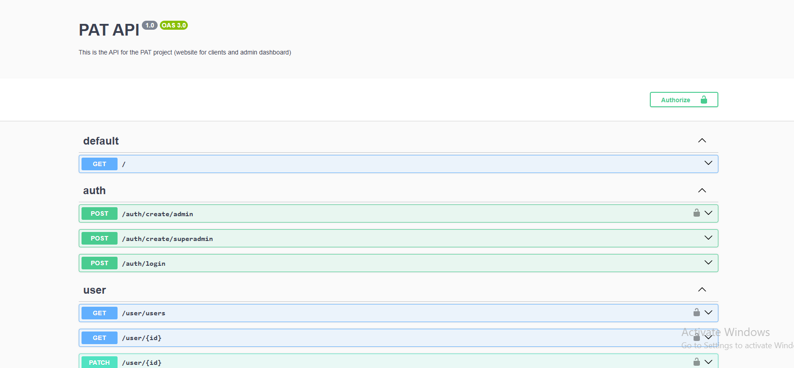

# NestJS Application Setup

This repository contains the backend application built with NestJS. Follow the steps below to set up and run the application locally.

## Prerequisites

- [Node.js](https://nodejs.org/)
- [npm](https://www.npmjs.com/) 
- [Git](https://git-scm.com/)

## Getting Started

### 1. Clone the Repository

First, clone the repository to your local machine:

```bash
$ git clone https://github.com/your-organization/your-repository.git
$ cd your-repository
```

2. Install Dependencies
Next, install the necessary dependencies:

```bash
$ npm install
```
3. Set Up Environment Variables
Make sure you have the necessary environment variables set up. You can create a .env file in the root of the project. Copy the contents of the .env.example file and update the values as needed.

    #### env file 
    ```
    # Database configuration
      DB_HOST=localhost
      DB_PORT=3306
      DB_USERNAME=root
      DB_PASSWORD=
      DB_NAME=pat
      
      # Application configuration
      APP_HOST=http://localhost
      APP_PORT=5000
      NODE_ENV=development
      
      # Frontend configuration
      FRONTEND_PORT_1=http://localhost:3000 # site vitrine
      FRONTEND_PORT_2=http://localhost:3001 # dashboard admin
      
      # keys configuration
      SECRET_KEY=qs3df51sfd35sqf1d5
      LICENSE=!569@pat1345
      
      # Mail configuration
      EMAIL_USER=
      EMAIL_PASSWORD=
      CONTACT_MAIL=
    ```

5. Run the Application
Finally, start the application:

```bash
$ npm run start
``` 

Once the application is running, you can access it at http://localhost:5000 (or whatever port you have configured).

#### Before using the API, you need to create a superadmin using the route `auth/create/superadmin`.

## Using Swagger
Swagger is integrated into this application to provide a user-friendly interface for exploring and testing the API endpoints.


### Accessing Swagger
To access the Swagger UI, navigate to http://localhost:5000/api in your web browser.


### Exploring Endpoints
Once you are on the Swagger UI page, you will see a list of available endpoints grouped by their controllers. You can expand each group to view the endpoints and their details.


### Testing Endpoints
You can test the endpoints directly from the Swagger UI by filling in the required parameters and clicking the "Execute" button.


